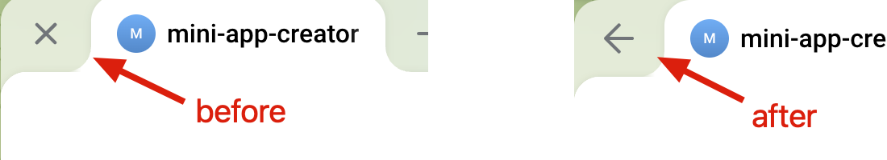
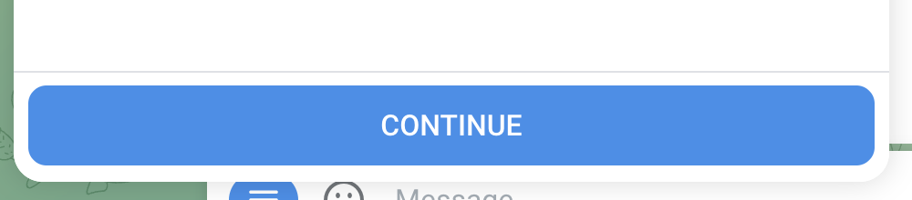
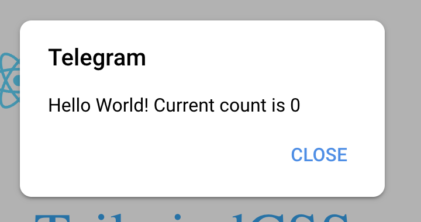

# Telegram Mini App React Starter

Telegram Mini App(TWA) is NOT like WeChat Miniprogram. TWA is a web app that can be embedded in Telegram app. This starter is a template for creating Telegram Mini App using React.

## Features

- [Vite](https://vitejs.dev/) for fast HMR
- [React](https://react.dev/) for building user interfaces
- [TypeScript](https://www.typescriptlang.org/) for static type checking
- [TailwindCSS](https://tailwindcss.com/) for styling
- [ESLint](https://eslint.org/) for linting
- [Prettier](https://prettier.io/) for code formatting
  - [prettier-plugin-organize-imports](https://github.com/simonhaenisch/prettier-plugin-organize-imports) for organizing imports
  - [prettier-plugin-tailwindcss](https://github.com/tailwindlabs/prettier-plugin-tailwindcss) for formatting Tailwind CSS
- [@twa-dev/sdk](https://github.com/twa-dev/SDK) for interating with Telegram


## Telegram Official UI components

> For more official components, check out [here](https://github.com/twa-dev/SDK?tab=readme-ov-file#react). The `<SecondaryButton />` does not show in my Telegram app.

- `<BackButton />`

  Works like browser back button. It will navigate back to the previous page.

  ```tsx
  import { BackButton } from "@twa-dev/sdk/react";

  <BackButton />
  ```

  ---

  

- `<ButtomBar />` and `<MainButton />`

  ```tsx
  import { BottomBar, MainButton } from "@twa-dev/sdk/react";

  <BottomBar>
    <MainButton text="Continue" 
      onClick={() => WebApp.showAlert(`Hello World!`)}
    />
  </BottomBar>
  ```

  


## TWA SDK API Usage

### WebApp.showAlert

```tsx
import WebApp from "@twa-dev/sdk";

WebApp.showAlert(`Hello World!`)
```

  
